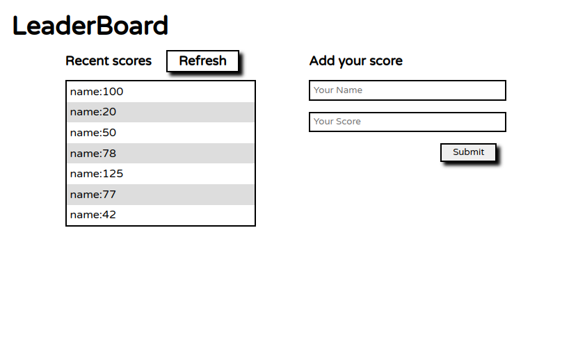

# # LeaderBoard

> The leaderboard website displays scores submitted by different players. It also allows you to submit your score. All data is preserved thanks to the external Leaderboard API service. Built using HTM/CSS|JavaScript|ES6|Webpack|Leaderboard API

## Sreenshot

## Built With (Linker)

- HTML (webHint)
- CSS (styleLint)
- JavaScript (EsLint)
- Es6 Module
- Webpack
- Leaderboard API service

## Project List

- Project 1: basic page structure.
- Project 2: send and receive data from API.
- Project 3: final touches.

# Setup

## Authors

👤 **Josh Batey**

- GitHub: [@Bateyjosue](https://github.com/Bateyjosue)
- Twitter: [@JosueBatey](https://twitter.com/josuebatey)
- LinkedIn: [Josue (Josh) Batey](https://www.linkedin.com/in/josue-ishara/)

## 🤝 Contributing

Contributions, issues, and feature requests are welcome!

## Show your support

Give a ⭐️ if you like this project!

## 📝 License

This project is [GNU](./LICENSE) licensed.
